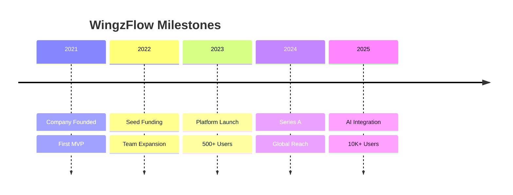

<div align="center">
  
# ✦ WINGZFLOW ✦

### *"Where Innovation Takes Flight"*

<br>

[](https://wingzflow.pages.dev)
[](https://github.com/wingzflow)
[](https://twitter.com/WingzFlow)

<br>


<br><br>

</div>

---

<!-- ANIMATED DIVIDER -->


---

## 🎨 ABOUT US

<div align="center">
  
> *"We don't just write code; we architect digital experiences that inspire, empower, and transform."*

</div>

<br>

<table>
<tr>
<td width="50%">

**WingzFlow** is a cutting-edge technology company that bridges the gap between **vision** and **execution**. We specialize in crafting sophisticated digital solutions that combine elegant design with robust engineering.

Our philosophy is rooted in the belief that technology should be:
- 🌟 **Human-centric** — Built for real people with real needs
- 🚀 **Forward-thinking** — Anticipating tomorrow's challenges today
- 💎 **Quality-driven** — Every pixel, every line of code matters

</td>
<td width="50%">

```python
class WingzFlow:
    def __init__(self):
        self.vision = "Digital Excellence"
        self.mission = "Empower through Innovation"
        self.values = ["Integrity", "Creativity", "Excellence"]
        self.team = ["Dreamers", "Builders", "Innovators"]
    
    def impact(self):
        return "Transforming ideas into reality"
    
    def future(self):
        return "Building tomorrow, today"
```

</td>
</tr>
</table>

---

## ✨ CORE EXPERTISE

<div align="center">

| Category | Technologies | Proficiency |
|----------|--------------|-------------|
| 🎯 **Frontend** | React, Next.js, Vue.js, Svelte | ⚡⚡⚡⚡⚡ |
| ⚙️ **Backend** | Node.js, Python, Go, Rust | ⚡⚡⚡⚡⚡ |
| 🗄️ **Database** | PostgreSQL, MongoDB, Redis, Elasticsearch | ⚡⚡⚡⚡ |
| ☁️ **Cloud** | AWS, GCP, Azure, Docker, K8s | ⚡⚡⚡⚡⚡ |
| 🤖 **AI/ML** | TensorFlow, PyTorch, OpenAI, LangChain | ⚡⚡⚡⚡ |
| 🎨 **Design** | Figma, Adobe Creative Suite, Blender | ⚡⚡⚡⚡ |

</div>

<br>

<div align="center">


</div>

---

## 🌟 PROJECT SHOWCASE

<div align="center">

### 🔥 Flagship Projects

</div>

<table>
<tr>
<td width="33%">

### 🚀 **FlowOS**
**Next-generation workflow automation platform**
- 🤖 AI-powered task orchestration
- 🔄 Real-time collaboration
- 📊 Advanced analytics dashboard

</td>
<td width="33%">

### 🌐 **WingNet**
**Decentralized cloud infrastructure**
- ☁️ Edge computing optimized
- 🔒 Enterprise-grade security
- ⚡ Sub-millisecond latency

</td>
<td width="33%">

### 🎯 **Aura AI**
**Intelligent business intelligence suite**
- 🧠 Predictive analytics
- 📈 Automated insights
- 🔮 Future trend forecasting

</td>
</tr>
</table>

---

## 📊 STATISTICS & METRICS

<div align="center">
  
<!-- Animated Counter -->


<br><br>

<table>
<tr>
<td align="center">
  
</td>
<td align="center">
  
</td>
</tr>
</table>

<br>

<table>
<tr>
<td align="center">
  
</td>
<td align="center">
  
</td>
</tr>
</table>

<br>

<!-- Activity Graph -->


</div>

---

## 🤝 COMMUNITY & COLLABORATION

<div align="center">

### 🌍 Let's Build Something Amazing Together

<br>

| We Offer | We Seek |
|----------|---------|
| 💡 Technical Expertise | 🎯 Visionary Ideas |
| 🏗️ Infrastructure & Scaling | 🤝 Strategic Partnerships |
| 🎨 Design & UX Excellence | 🌱 Open Source Contributions |
| 📚 Knowledge Sharing | 💬 Community Feedback |
| 🔧 Tooling & Automation | 🧪 Beta Testing |

</div>

---

## 📈 OUR JOURNEY

<div align="center">



</div>

<br>

<div align="center">

[](https://star-history.com/#wingzflow/wingzflow&Date)

</div>

---

## 🎯 CURRENT FOCUS

<div align="center">

### 🔭 What We're Building Now

</div>

```javascript
const currentProjects = {
  "🚀 Project Phoenix": {
    status: "Active Development",
    tech: ["React", "Node.js", "GraphQL", "PostgreSQL"],
    eta: "Q4 2024"
  },
  "🧠 Neuron AI": {
    status: "Research Phase",
    tech: ["Python", "TensorFlow", "LangChain", "Vector DB"],
    eta: "Q1 2025"
  },
  "☁️ CloudMesh": {
    status: "Beta Testing",
    tech: ["Go", "Kubernetes", "Redis", "WebAssembly"],
    eta: "Q3 2024"
  }
}
```

---

## 🌱 LEARNING & GROWTH

<div align="center">
  
### 📚 Continuous Learning Culture

</div>

| Area | Focus | Status |
|------|-------|--------|
| 🧠 **AI/ML** | LLMs, Neural Networks, Reinforcement Learning | 🟢 Active |
| 🔗 **Blockchain** | Smart Contracts, DeFi, Web3 | 🟡 Exploring |
| 🎮 **Game Dev** | Unity, Unreal Engine, WebGL | 🟢 Active |
| 🛡️ **Security** | Zero Trust Architecture, Penetration Testing | 🟠 Advanced |
| 📱 **Mobile** | React Native, Flutter, SwiftUI | 🟢 Active |

---

## 💬 CONNECT WITH US

<div align="center">

| Platform | Handle | Purpose |
|----------|--------|---------|
| 🌐 **Website** | [wingzflow.pages.dev](https://wingzflow.pages.dev) | Main Hub |
| 🐦 **Twitter** | [@WingzFlow](https://twitter.com/WingzFlow) | Updates & Announcements |
| 💼 **LinkedIn** | [WingzFlow](https://linkedin.com/company/wingzflow) | Professional Network |
| 📧 **Email** | [contact@wingzflow.dev](mailto:contact@wingzflow.dev) | Business Inquiries |
| 💬 **Discord** | [Join Our Server](https://discord.gg/wingzflow) | Community Chat |
| 📱 **Instagram** | [@wingzflow](https://instagram.com/wingzflow) | Behind the Scenes |

</div>

---

## 🏆 ACHIEVEMENTS & RECOGNITION

<div align="center">


<br><br>

<table>
<tr>
<td align="center">
  
</td>
<td align="center">
  
</td>
<td align="center">
  
</td>
</tr>
</table>

</div>

---

## 🎉 FUN CORNER

<div align="center">

### ⚡ Fun Facts About WingzFlow

</div>

<details>
<summary><b>Click to reveal some surprises! 🎊</b></summary>
<br>

<table>
<tr>
<td>

**🎮 Game Room**
- We have a dedicated gaming room with all consoles
- Monthly Mario Kart tournaments (CEO is undefeated... for now)
- Game development side projects on weekends

</td>
<td>

**☕ Coffee Culture**
- We consume 50+ cups of coffee daily
- Have a barista on staff (yes, really!)
- Created our own custom coffee blend called "Flow Fuel"

</td>
</tr>
<tr>
<td>

**🌍 Global Team**
- Team members in 7 different countries
- Daily standups across 4 time zones
- Company language: English with a hint of "Spanglish"

</td>
<td>

**🎵 Music Vibes**
- Collaborative coding playlist with 1000+ songs
- Lo-fi girl is our team mascot
- Some of us moonlight as DJs on weekends

</td>
</tr>
</table>

</details>

---

## 📝 LATEST BLOG POSTS

<div align="center">

*Coming Soon — Our engineering blog!*

<br>

[](https://blog.wingzflow.dev)

</div>

---

## 🤝 SUPPORT & CONTRIBUTE

<div align="center">

### 💫 How You Can Help

| Action | Impact |
|--------|--------|
| ⭐ **Star our repos** | Increases visibility |
| 🍴 **Fork & contribute** | Improves our projects |
| 🐛 **Report issues** | Makes our code better |
| 📢 **Share our work** | Grows our community |
| 💡 **Suggest ideas** | Sparks innovation |

<br>

<a href="https://github.com/wingzflow">
  
</a>
<a href="https://github.com/sponsors/wingzflow">
  
</a>

</div>

---

## 📜 LEGAL

<div align="center">

**© 2024 WingzFlow. All rights reserved.**

Built with ❤️ and ☕ by the WingzFlow Team

<br>

[](LICENSE)
[](https://wingzflow.pages.dev/privacy)
[](https://wingzflow.pages.dev/terms)

</div>

---

<!-- ANIMATED FOOTER -->


<div align="center">

## ✦ Thank You for Visiting WingzFlow ✦

> *"The future belongs to those who believe in the beauty of their dreams."*
> — Eleanor Roosevelt

<br>

**Let's create something extraordinary together!** 🌟

<br>

[⬆ Back to Top](#)

</div>

- Learning roadmap
- Community engagement sections
- Legal and compliance info
